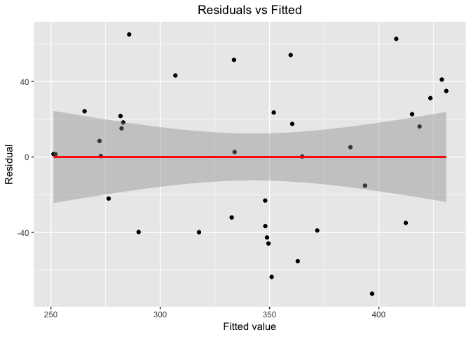

Report
================
2018/12/3

Group project report

Member: Haowei Ni, Qinyao Wu, Jiabei Wang, Shuo Yan, Bihui Sun

• Motivation:
-------------

The goal of this project is to analysis the factor that might contribute to the mortality rate of heart disease both demographically and geographically. The motivation is that as a public health student, it is our responsibility to learn about the diseases that keep threatening our lives and take early action for prevention. We believe that explore the factors that might related to the mortality rate of heart disease might be the next step that people take to assess possible treatment options.

• Related work:
---------------

Heart disease is the leading cause of death for both men and women. About 610,000 people die of heart disease in the United States every year–that’s 1 in every 4 deaths. It is also the leading cause of death in most ethnicities groups, including white, African American, Asian and Hispanic.

• Initial questions:
--------------------

What was the geographic distribution of mortality rate? Does the mortality rate has difference between the state that are in coastal area or inland area? Does the rate affect by the longitude or latitude? Which ethnic group has the highest morality rate? Does men have higher mortality rate than women? Are there any interactions between these two factors. After adding other variables that might affect the mortality rate, we came up with a new question. Can we make a logistic model for heart disease mortality rate based on the variables that have significant correlation?

• Data:
-------

The data were obtained when searching for the key world “heart disease mortality rate” on the website <https://www.data.gov/> This website is an open data source in US that covered various topics including “Health”, which we take most interest in. Data was updated on August 20, 2018 that describes heart disease mortality rate among US adults (35+) by state and county.

First we import the original dataset that we have downloaded from data.gov and stored in our google sheet.

``` r
heart_disease_link = "https://docs.google.com/spreadsheets/d/1W-xVHLoeZj37wrZdX-dP_SVouZKg5VmTpFdmOLWByR4/edit?usp=sharing"

heart_disease_stratify = gsheet2tbl(heart_disease_link) %>%

  janitor::clean_names() %>%
  rename(state = location_abbr) %>%
  rename(mortality_rate = data_value) %>%

  mutate(state = state.name[match(state, state.abb)]) %>% 
  select(-data_source, -geographic_level, -class, -topic, -data_value_footnote, -data_value_footnote_symbol, -topic_id, -location_id ) 

heart_disease = heart_disease_stratify %>% 
  filter(stratification1 == "Overall", stratification2 == "Overall") %>% 
  select(-stratification1, -stratification2, -stratification_category1, -stratification_category2) 
```

Then we tidied the data set by grouping with states.

``` r
heart_disease$mortality_rate[is.na(heart_disease$mortality_rate)] = 0

heart_disease = 
heart_disease %>% 
  group_by(state) %>% 
  summarise(mortality_rate = mean(mortality_rate))
```

Then we add more variables from additional resources.

•1. Add air quality data and tidy the dataset.

``` r
airquality_link = "https://docs.google.com/spreadsheets/d/1CRJzMI0QbqU34BZZQ1bg3BnZPM_oUfVUCVPOo4AnoB0/edit?usp=sharing"

airquality_2015 =
  gsheet2tbl(airquality_link) %>%
  janitor::clean_names() %>%
  select(state, pm2_5) %>%   
  group_by(state) %>% 
  summarize(pm2.5 = sum(pm2_5))
```

•2. Add obesity data and tidy the dataset.

``` r
obesity_data_link = "https://docs.google.com/spreadsheets/d/1zlB2cOOMvD-IJIiGQ6YOyQ6QEXEKVAkrPTzxZrYci28/edit?usp=sharing"

obesity_data = gsheet2tbl(obesity_data_link) %>%
  janitor::clean_names() %>%
  rename(state = name) %>%
  rename(obesity_percentage = obesity) %>%
  select(state, obesity_percentage) 
data_with_obesity = left_join(heart_disease, obesity_data)
```

    ## Joining, by = "state"

•3. Add stroke data and tidy the dataset.

``` r
stroke_data_link = "https://docs.google.com/spreadsheets/d/1AZkDl8sNrTDnEX3Fhp1MeWNKNj9rnXaKaMbpVGndv5s/edit?usp=sharing"

stroke_data = gsheet2tbl(stroke_data_link) %>%
  janitor::clean_names() %>%
  rename(stroke_value = data_value) %>%
  rename(state = location_abbr) %>%
  mutate(state = state.name[match(state, state.abb)]) %>%

  select(state,stroke_value) %>% 
  group_by(state) %>% 
  filter(!is.na(stroke_value)) %>% 
  summarize(stroke_value = sum(stroke_value)) 
```

•4. Add income data and tidy the dataset.

``` r
income_data_link = "https://docs.google.com/spreadsheets/d/1_Rd_dxRgMqOCaFC-8fWz6QODG8_IBZl1DnQOFaRxF0Q/edit?usp=sharing"

income_data = gsheet2tbl(income_data_link) %>% 
  rename(state = "X1", us = "X2", median_income = "X3", income_standard_error = "X4" )
```

    ## Warning: Missing column names filled in: 'X1' [1], 'X2' [2], 'X3' [3],
    ## 'X4' [4]

``` r
income_data = income_data[3:53,]


data_with_income = left_join(heart_disease,income_data, by = "state")

data_income_obesity = left_join(income_data,data_with_obesity, by = "state")
```

•5. Add smoking data and tidy the dataset.

``` r
smoking_data_link = "https://docs.google.com/spreadsheets/d/1ZU7uuqV-EZM81hE4kq0nFiPJHUMJj82fnXVllGFHJ00/edit?usp=sharing"

smoking_data = gsheet2tbl(smoking_data_link) %>% 
  filter(YEAR == "2015-2016") %>% 

  mutate(year = 2015) %>% 
  rename(state = LocationDesc) %>% 
  select(-YEAR) %>%
  filter(!is.na(Data_Value)) %>%

  select(year, state, Data_Value) %>% 

  select(year, state, Data_Value) %>% 
  rename(tobacco_comsumption = Data_Value) %>% 
  group_by(state) %>% 
  summarise(tobacco_consumption = sum(tobacco_comsumption))
```

Then we combine all the data with the original data set to generate our final data.

``` r
data_income_obesity_smoking = left_join(smoking_data, data_income_obesity, by = "state")

data_income_obesity_smoking_air = left_join(airquality_2015, data_income_obesity_smoking, by = "state")


data_income_obesity_smoking = left_join(smoking_data, data_income_obesity, by = "state")
data_income_obesity_smoking_air = left_join(airquality_2015, data_income_obesity_smoking, by = "state")
```

Here is our final data.

``` r
final_data_export = left_join(stroke_data, data_income_obesity_smoking_air, by = "state") 

final_data_link = "https://docs.google.com/spreadsheets/d/1ifmyU22AaB81PvMDCCRrsIqtifa0FuKhH5MpI_FU0Sc/edit?usp=sharing"

final_data = gsheet2tbl(final_data_link)
```

    ## Warning: Missing column names filled in: 'X1' [1]

• Scrape and Clean:
-------------------

There are total 59076 rows and 19 variables in the original dataset. It describes the mortality rate across each county in year 2015. First, we removed 8 columns that basically give no useful information for analysis such as “data\_source”, “class”, “topic”, “stratification1”, etc. Second, since we are looking for a more general result in a larger geographically scale, we create a new dataset that calculate the total and summarize the mean mortality rate in each state called “heart\_disease.csv”. Then we added 5 other variables that might affect the mortality rate. For air quality, tobacco consumption, and stroke data, we take the sum value for each state. For obesity data, we take the mean percentage for each state.For income, we take the median for each state. Then we create a new dataset called “final\_data.csv” by joining the new variables with the mortality rate across each state.

• Exploratory analysis:
-----------------------

For each variable, we make a scatterplot that can compare the mortality rate trend with the corresponding variable across each state. Then we make a simple linear regression to determine whether the variable has significant correlation with the mortality rate.

#### 1. Air quality

``` r
final_data %>% 
  mutate(state = fct_reorder(state, mortality_rate)) %>% 
  ggplot(aes(x = pm2.5, y = mortality_rate, color = state)) + 
  geom_point() +
  ggtitle("Heart Disease Mortality VS Airquality") +
  stat_smooth(method = "lm", col = "red") +
   theme(text = element_text(size = 8), 
        legend.position = "bottom",
        plot.title = element_text(hjust = 0.5)) + 
  labs(x = "PM2.5 value",
       y = "Mortality Rate") 
```


``` r
## fit simple linear regression model 

lm(final_data$mortality_rate ~ final_data$pm2.5) %>% 
  broom::tidy() %>% 
  knitr::kable()
```

| term              |     estimate|   std.error|   statistic|    p.value|
|:------------------|------------:|-----------:|-----------:|----------:|
| (Intercept)       |  338.1788076|  14.2703341|  23.6980302|  0.0000000|
| final\_data$pm2.5 |    0.0009734|   0.0046731|   0.2083025|  0.8358741|

From the scatterplot we can see that the points are spread randomly. However, the relationship between pm2.5 and mortality rate is unclear. For the states, with low pm2.5, some of them have low mortality rate and some of them have high mortality rate. After we fit the simple regression model, the p-value for pm2.5 is 0.836, so it is a non-significant variable.

#### 2. Obesity

``` r
final_data %>%
  ggplot(aes(x = obesity_percentage, y = mortality_rate)) + 
  geom_point(aes(color = state), alpha = .5) +
  stat_smooth(method = "lm", col = "red") +
  labs(
    x = "Obesity(%)",
    y = "Mortality Rate",
    title = "Heart Disease Mortality vs Obesity"
  ) +
  theme(text = element_text(size = 8), 
        legend.position = "bottom",
        plot.title = element_text(hjust = 0.5))
```


``` r
## fit simple linear regression model 
  
  lm(mortality_rate ~ obesity_percentage, data = final_data) %>%
    broom::tidy() %>% 
    knitr::kable()
```

| term                |   estimate|  std.error|   statistic|    p.value|
|:--------------------|----------:|----------:|-----------:|----------:|
| (Intercept)         |  -17.78153|  46.853534|  -0.3795132|  0.7059807|
| obesity\_percentage |   12.17623|   1.579593|   7.7084604|  0.0000000|

From the plot we can observe that the fitted line is upward indicating that as the obesity percentage goes higher, the mortality rate would increase correspondingly. As we can see, the p-value is extremely small which means there is a strong association between obesity and heart disease mortality.

#### 3. Stroke

``` r
final_data %>%
  ggplot(aes(x = stroke_value, y = mortality_rate)) + 
  geom_point(aes(color = state), alpha = .5) +
  stat_smooth(method = "lm", col = "red") +
  labs(
    x = "Stroke Value",
    y = "Mortality Rate",
    title = "Heart Disease Mortality Rate vs Stroke Value"
  ) +
   theme(text = element_text(size = 8), 
        legend.position = "bottom",
        plot.title = element_text(hjust = 0.5))
```


``` r
## fit simple linear regression model 
  
  lm(mortality_rate ~ stroke_value, data = final_data) %>%
    broom::tidy() %>% 
    knitr::kable()
```

| term          |     estimate|   std.error|  statistic|    p.value|
|:--------------|------------:|-----------:|----------:|----------:|
| (Intercept)   |  303.9956221|  11.7692525|  25.829646|  0.0000000|
| stroke\_value |    0.0008308|   0.0002043|   4.066454|  0.0001766|

From the linear regression, we find that p-value is less than 0.00018, indicates there is very significant association between stroke and heart disease mortality. From the plot, we can see that with higher stroke value, the heart disease mortality rate goes higher.

#### 4. Income

``` r
final_data_income = 
  final_data %>% 
  mutate(state = forcats::fct_reorder(factor(state), median_income)) 

final_data_income %>% 
  ggplot(aes(x = median_income, y = mortality_rate, color = state)) +
  geom_point() +
  stat_smooth(method = "lm", col = "red") +
   theme(text = element_text(size = 8), 
        legend.position = "bottom",
        plot.title = element_text(hjust = 0.5)) +
  labs(
    title = "Heart Disease Mortality Rate vs Median Income",
    x = "Median Income",
    y = "Mortality Rate"
  )
```


``` r
## fit simple linear regression model 

lm(mortality_rate ~ median_income, data = final_data_income) %>% 
  broom::tidy() %>% 
  knitr::kable()
```

| term           |     estimate|   std.error|  statistic|  p.value|
|:---------------|------------:|-----------:|----------:|--------:|
| (Intercept)    |  610.2373902|  39.9405637|  15.278637|        0|
| median\_income |   -0.0048261|   0.0007058|  -6.838044|        0|

From the plot we can see the fitted line is downward implying that the state with highst median income tend to have the lowest mortality rate. From the lm result, we can observe that median income is a very significant variable with a p-value of 1.3e-08. This indicates that there is a strong association between income and heart disease mortality rate.

#### 5 Tabacco consumption

``` r
 final_data %>%
  mutate(state = forcats::fct_reorder(factor(state), tobacco_consumption)) %>%
  ggplot(aes(x = tobacco_consumption, y = mortality_rate )) + 
  geom_point(aes(color = state), alpha = .5) +
  stat_smooth(method = "lm", col = "red") +
  labs(
    x = "Tobacco Consumption Value",
    y = "Mortality Rate",
    title = "Heart Disease Mortality Rate VS Tobacco Consumption Value"
  ) +
   theme(text = element_text(size = 8), 
        legend.position = "bottom",
        plot.title = element_text(hjust = 0.5))
```


``` r
## fit simple linear regression model 
 
lm(mortality_rate ~ tobacco_consumption, data = final_data) %>%
  broom::tidy() %>% 
  knitr::kable()
```

| term                 |     estimate|   std.error|  statistic|    p.value|
|:---------------------|------------:|-----------:|----------:|----------:|
| (Intercept)          |  241.8405899|  45.2029014|   5.350112|  0.0000056|
| tobacco\_consumption |    0.8384022|   0.3669033|   2.285077|  0.0284808|

From the plot we can seethe fitted line fails to catch most of the points and points are spread randomly, so at this point we cannot make any conclusion. From the simple linear regression model, we can know the p-value is 0.028 &lt; 0.05 which indicates that there is strong correlation between tabacco comsumption and heart disease.

• Additional analysis:
----------------------

Because gender and race are categorical variable, so we want to measure the interaction between these two. Gender and race will affect the relationship between stroke and mortality rate.

#### 1. Gender v.s. Stroke

``` r
new_heart_gender_data = gsheet2tbl(heart_disease_link) %>%
  janitor::clean_names() %>%
  rename(state = location_abbr) %>%
  rename(mortality_rate = data_value) %>%
  rename(gender = stratification1) %>%
  rename(race =  stratification2) %>%
  mutate(state = state.name[match(state, state.abb)]) %>%
  filter(gender %in% c("Male","Female")) %>%
  filter(race == "Overall") %>%
  select(state,location_desc, mortality_rate,gender)

new_stroke_gender_data = gsheet2tbl(stroke_data_link) %>%
  janitor::clean_names() %>%
  rename(state = location_abbr) %>%
  rename(stroke_value = data_value) %>%
  rename(gender = stratification1) %>%
  rename(race = stratification2) %>%
  mutate(state = state.name[match(state, state.abb)]) %>%
  filter(gender %in% c("Male","Female")) %>%
  filter(race == "Overall") %>%
  select(state, location_desc, stroke_value,gender)
new_gender_data = left_join(new_heart_gender_data,new_stroke_gender_data) %>%
  filter(!is.na(stroke_value))

lm(mortality_rate~stroke_value+gender+stroke_value*gender,data = new_gender_data) %>% 
  broom::tidy() %>% 
  knitr::kable()
```

| term                     |     estimate|  std.error|  statistic|  p.value|
|:-------------------------|------------:|----------:|----------:|--------:|
| (Intercept)              |  112.4951619|  6.2709892|  17.938982|        0|
| stroke\_value            |    2.2135119|  0.0802790|  27.572728|        0|
| genderMale               |  111.9970676|  8.5616732|  13.081213|        0|
| stroke\_value:genderMale |    0.6111176|  0.1080245|   5.657213|        0|

``` r
ggplot(new_gender_data,aes(x = stroke_value, y = mortality_rate)) +
  geom_point(aes(color = gender), alpha = .5) +
  labs(
    x = "Stroke Value",
    y = "Mortality Rate",
    title = "Heart Disease Mortality Rate VS Stroke Value for Different Genders"
  ) +
   theme(text = element_text(size = 8), 
        legend.position = "bottom",
        plot.title = element_text(hjust = 0.5))
```


From the linear regression we can see that gender is an effect modifier that influences the relationship between heart disease mortality and stroke mortality. The plot shows that male and female have similar stroke mortality, but male have obviously higher heart disease mortality rate.

#### 2. Race v.s. Stroke

``` r
new_heart_race_data = gsheet2tbl(heart_disease_link) %>%
  janitor::clean_names() %>%
  rename(state = location_abbr) %>%
  rename(mortality_rate = data_value) %>%
  rename(gender = stratification1) %>%
  rename(race = stratification2) %>%
  mutate(state = state.name[match(state, state.abb)]) %>%
  filter(gender == "Overall") %>%
  filter(!(race == "Overall")) %>%
  select(state, location_desc, mortality_rate, race)

new_stroke_race_data = gsheet2tbl(stroke_data_link) %>%
  janitor::clean_names() %>%
  rename(state = location_abbr) %>%
  rename(stroke_value = data_value) %>%
  rename(gender = stratification1) %>%
  rename(race = stratification2) %>%
  mutate(state = state.name[match(state, state.abb)]) %>%
  filter(gender == "Overall") %>%
  filter(!(race == "Overall")) %>%
  select(state, location_desc, stroke_value,race)
new_race_data = left_join(new_heart_race_data,new_stroke_race_data) %>%
  filter(!is.na(stroke_value))


lm(mortality_rate~stroke_value + race+stroke_value*race,data = new_race_data) %>% 
  broom::tidy() %>% 
  knitr::kable()
```

| term                                         |     estimate|   std.error|   statistic|    p.value|
|:---------------------------------------------|------------:|-----------:|-----------:|----------:|
| (Intercept)                                  |  175.9393665|  13.1181188|   13.411936|  0.0000000|
| stroke\_value                                |    2.5702619|   0.1565890|   16.414068|  0.0000000|
| raceAsian and Pacific Islander               |  -50.8486724|  15.7665904|   -3.225090|  0.0012654|
| raceBlack                                    |   95.0940582|  15.3999780|    6.174948|  0.0000000|
| raceHispanic                                 |  -62.8308630|  14.8477653|   -4.231671|  0.0000235|
| raceWhite                                    |  -23.2945875|  15.0277563|   -1.550104|  0.1211640|
| stroke\_value:raceAsian and Pacific Islander |   -2.0686943|   0.2011428|  -10.284707|  0.0000000|
| stroke\_value:raceBlack                      |   -1.1864310|   0.1721524|   -6.891749|  0.0000000|
| stroke\_value:raceHispanic                   |   -1.1270795|   0.1901087|   -5.928605|  0.0000000|
| stroke\_value:raceWhite                      |    0.1905714|   0.1830054|    1.041343|  0.2977540|

``` r
ggplot(new_race_data, aes(x = stroke_value, y = mortality_rate)) +
  geom_point(aes(color = race)) +
  labs(
    x = "Stroke Value",
    y = "Mortality Rate",
    title = "Heart Disease Mortality Rate VS Stroke Value for Different Races"
  ) +
   theme(text = element_text(size = 8), 
        legend.position = "bottom",
        plot.title = element_text(hjust = 0.5))
```


From the linear regression, we can see that reaces(except the White) modify the relationship between heart disease mortality and stroke mortality. Black people have highest heart disease mortality rate while Hispanic has the least.

#### 3. MLR

Further more, we make a multi-linear regression model that only includes the significant variables that we have discussed above.

``` r
final_data = final_data

lm(mortality_rate ~ tobacco_consumption + median_income + obesity_percentage + pm2.5 + stroke_value, data = final_data) %>%
    broom::tidy() %>% 
    knitr::kable()
```

| term                 |     estimate|    std.error|  statistic|    p.value|
|:---------------------|------------:|------------:|----------:|----------:|
| (Intercept)          |  265.6040888|  111.0485303|   2.391784|  0.0230185|
| tobacco\_consumption |   -0.1949951|    0.3276359|  -0.595158|  0.5560579|
| median\_income       |   -0.0027163|    0.0009789|  -2.774957|  0.0092715|
| obesity\_percentage  |    8.4198965|    3.0039346|   2.802956|  0.0086549|
| pm2.5                |   -0.0040359|    0.0039113|  -1.031861|  0.3101209|
| stroke\_value        |    0.0003026|    0.0002155|   1.403914|  0.1702838|

``` r
total_lm = lm(mortality_rate ~ tobacco_consumption + median_income + obesity_percentage + pm2.5 + stroke_value, data = final_data) %>%
  fortify()


ggplot(total_lm, aes(x = .fitted, y = .resid)) + geom_point() + 
  stat_smooth(method = "lm", col = "red") +
  labs(
    x = "Fitted value",
    y = "Residual",
    title = "Residuals vs Fitted"
  ) +
  theme(plot.title = element_text(hjust = 0.5))
```



The linear model is heart disease mortality = 266 + -0.0027 x median income + 8.4 x obesity percentage. This result indicates that Obesity level contributes a lot to the occurence of heart disease mortality.

• Dashboard and Shiny Dashiboard:
---------------------------------

We used a dashboard and shinydashboard to demonstrate and compare the association between different factors and heart disease mortality. The shiny Dashboard shows the density of the disease motality and we can use that to comapre with the density of other factors. For example, we observed that the density of obesity is much higher in the mdidle west part of the country, which has a high coincidence with the density of heart disease mortality. And this also helps to prove that obesity is a very significant factor for cause of disease in heart disease. The code for shiny can be found in tidy/shiny.Rmd.

• Discussion:
-------------

We found that obesity and income level has huge contribution to the heart-disease mortality rate. There is negative relationship between income level and mortality rate. And postive relationship between obesity percentage and mortality rate. However, smoking status, airquality and stroke don't have linear relationship with heart disease mortality rate. It is unexpected because we think poor airquality and heavy smoking would increase the mortality rate. In the further analysis, we can try non-linear models.

• Links to access the data
--------------------------

### \* Heart disease data:

#### <https://docs.google.com/spreadsheets/d/1W-xVHLoeZj37wrZdX-dP_SVouZKg5VmTpFdmOLWByR4/edit?usp=sharing>

### \* Air Quality data:

#### <https://docs.google.com/spreadsheets/d/1CRJzMI0QbqU34BZZQ1bg3BnZPM_oUfVUCVPOo4AnoB0/edit?usp=sharing>

### \* Obesity data:

#### <https://docs.google.com/spreadsheets/d/1zlB2cOOMvD-IJIiGQ6YOyQ6QEXEKVAkrPTzxZrYci28/edit?usp=sharing>

### \* Stroke data:

#### <https://docs.google.com/spreadsheets/d/1AZkDl8sNrTDnEX3Fhp1MeWNKNj9rnXaKaMbpVGndv5s/edit?usp=sharing>

### \* Income data:

#### <https://docs.google.com/spreadsheets/d/1_Rd_dxRgMqOCaFC-8fWz6QODG8_IBZl1DnQOFaRxF0Q/edit?usp=sharing>

### \* Smoking data:

#### <https://docs.google.com/spreadsheets/d/1ZU7uuqV-EZM81hE4kq0nFiPJHUMJj82fnXVllGFHJ00/edit?usp=sharing>

### \* Final data:

#### <https://docs.google.com/spreadsheets/d/1ifmyU22AaB81PvMDCCRrsIqtifa0FuKhH5MpI_FU0Sc/edit?usp=sharing>
