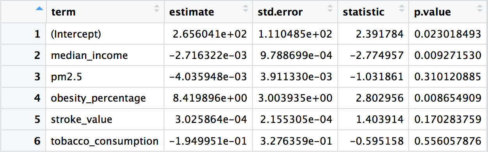

###MLR Result

The logistic multiple linear regression model were generated and the result was shown below. This MLR model looks at the association between the mortality of heart disease and the five factors that we are interested in. The five factors are stroke value, median income, the air quality, the obesity percentage and the tobacco consumptions. 

###Final Model

heart disease mortality = 266 + -0.0027 x median income + 8.4 x obesity percentage. 

This result indicates that Obesity level contributes a lot to the occurence of heart disease mortality. 
